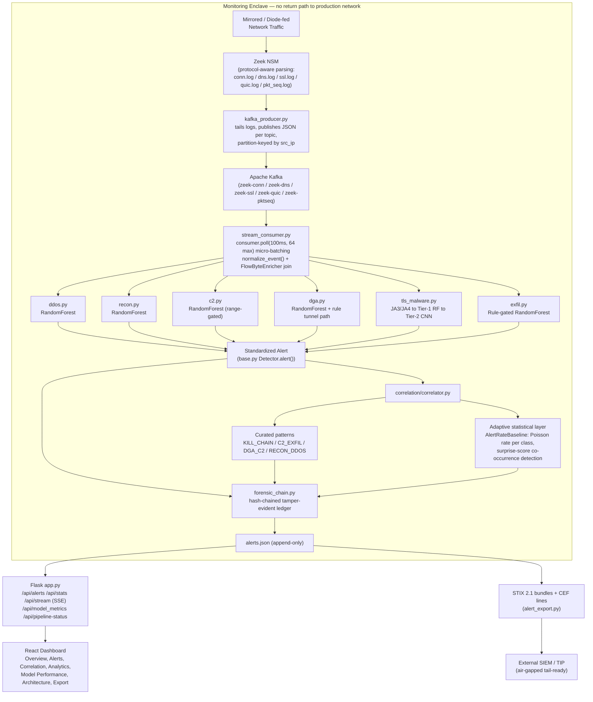
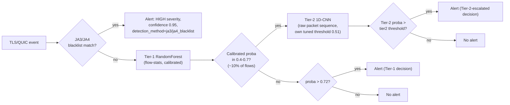
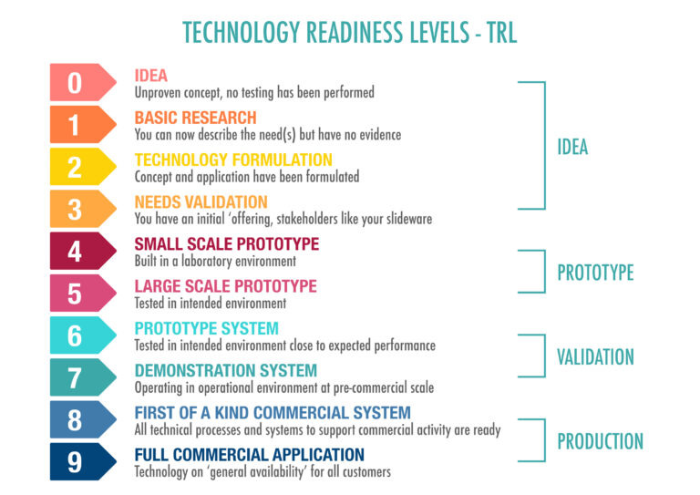

# ODIN — Unidirectional Threat Detection Platform
### SIH Presentation Master Document
**Problem Statement 26145** — *AI-Based Detection of Cyber Threats in Unidirectional IP Traffic*
**Organization:** National Technical Research Organisation (NTRO) · **Theme:** Blockchain & Cybersecurity
**Document version:** 2026-09-15

---

## 1. The Idea, in One Paragraph

Critical-infrastructure operators mirror gateway/peering traffic into an isolated monitoring enclave through a hardware data diode — the enclave can *see* everything but has **no protocol-level path back** into the production network. ODIN is an AI/ML pipeline built specifically for that one-way vantage point: it ingests passively-captured flow and metadata (never payload), runs six purpose-built, calibrated classifiers in a real streaming pipeline (Zeek → Kafka → detectors), correlates alerts across threat classes using both curated attack-chain patterns and a self-calibrating statistical layer, and emits standardized, evidence-backed, tamper-evident alerts to a live dashboard and to SIEM/TIP tooling via STIX 2.1/CEF export. Every claim in this document is backed by a metrics file, a benchmark script, or a passing test — nothing here is a mockup number.

---

## 2. Alignment with the Problem Statement

### 2.1 Named threat classes (PS 26145's core ask)

| # | PS-named threat | Detector | Detection approach | Training data | Held-out F1 |
|---|---|---|---|---|---|
| a | Volumetric/protocol DDoS (SYN flood, UDP reflection, spoofed-source) | `ddos.py` | RandomForest on rate/entropy/timing features, 10s rolling window | Real `hping3` (rate-bounded, never `--flood`) + real socket traffic | **0.997** |
| b | Botnet C2 beaconing | `c2.py` | RandomForest on inter-arrival timing statistics, range-gated | Real self-built C2 beacon emulator + real CTU-13 botnet pcaps | **1.000** |
| c | DGA domains / DNS tunnelling | `dga.py` | RandomForest on entropy/n-gram/word-boundary features + rule-based tunnel path | Synthetic (9 published DGA algorithm families) + 6,000 real UMUDGA malware domains | **0.995** |
| d | Malware inside encrypted sessions (TLS/QUIC, no decryption) | `tls_malware.py` | JA3/JA4 blacklist → Tier-1 RandomForest (flow stats) → Tier-2 1D-CNN (raw packet-size/gap sequence) on the ambiguous ~10% band | Real benign TLS/QUIC (142+ real domains) + synthetic malicious (flow-stats); 13 real CTU-13 malicious rows for Tier-2 | Tier-1 **1.000** / Tier-2 **0.952** |
| e | Reconnaissance / port scanning | `recon.py` | RandomForest on fan-out/entropy features, 60s per-source window | Real `nmap -sT` scans + real socket traffic | **1.000** |
| f | Data exfiltration | `exfil.py` | Rule-gated RandomForest on byte-ratio/timing asymmetry | Real HTTP/ICMP/DNS transfers + synthetic covert-channel shapes | **1.000** |

**All six PS-named classes have a real, trained, calibrated detector wired into a live streaming pipeline** — not a checklist stub. Held-out F1 above is the deployed model's own confusion matrix (`docs/metrics/*.json`), not a cross-validation number that scores a temporarily-refit model.

### 2.2 Architectural constraints (PS 26145's "Expected Solution" section)

| Constraint | Status | Evidence |
|---|---|---|
| **(a) Read-only ingest** — no return path, no live query, no inline block | ✅ Met | `Zeek -i lo` passive capture → Kafka → detectors; `/api/pipeline-status` reports `"return_path": "NONE"` live |
| **(b) No payload decryption** | ✅ Met | TLS/QUIC detector reads only JA3/JA4 fingerprints + packet-size/timing metadata (`zeek/scripts/pkt_seq.zeek`), never decrypted content |
| **(c) Streaming, not batch** | ✅ Met | `stream_consumer.py` processes a live Kafka stream with `consumer.poll(timeout_ms=100, max_records=64)` micro-batching — alerts emitted with bounded (~100ms dispatch) latency, not end-of-run |
| **(d) Defined, demonstrated throughput** | ✅ Met | Isolated: **337.8 flows/sec** (4.74× over the pre-optimization baseline). Live, Kafka-broker-inclusive E2E: **peak 22.2 → 292 events/sec** across three runs (honestly reported with variance — see §9) |
| **(e) Standardized alert schema** | ✅ Met | Every alert carries `timestamp, event_ts, flow_id, src_ip, dst_ip, threat_class, severity, confidence (calibrated), evidence, detection_method`; exported live as **STIX 2.1** bundles and **CEF** lines for SIEM/TIP ingestion, plus a hash-chained tamper-evident ledger (`forensic_chain.py`) answering the PS's own "preserves chain of custody" rationale |

### 2.3 Effectiveness — beyond a single-host lab number

A common failure mode for prototypes like this is validating only on a single test host, then quietly failing on real network diversity. ODIN's multi-host validation (`ODIN_P11_Before_After_Evaluation.md`) explicitly tested this and reports the honest before/after:

| Detector | Loopback-only baseline (multi-host traffic) | After multi-host retraining | What changed |
|---|---|---|---|
| DDoS | F1 0.784, **33.4% false-positive rate** on spoofed multi-host floods | F1 **0.999**, **0.12% false-positive rate** | The old model had never seen `unique_src_ips`/`src_ip_entropy` vary — it flooded the SOC with false alarms the moment real network diversity appeared. Fixed by real multi-host capture (Docker lab: attacker/victim/benign/external hosts), not synthetic data. |
| C2 | Recall 56.8% on multi-host beacon traffic | Recall **100%** | Old model missed 43% of real multi-host beacons; root cause and fix identical pattern to DDoS. |
| Recon | F1 0.9997 (already near-ceiling) | F1 0.9997 (unchanged) | No regression — reported plainly, not manufactured as a win. |
| Exfil | F1 1.000 (already near-ceiling) | F1 1.000 (unchanged) | Byte-ratio/duration features are topology-independent; honestly reported as "no measurable gain here" rather than inventing one. |

**No regression was found or hidden anywhere in this retrain.** This kind of explicit, split-by-traffic-origin before/after table — including the two detectors where nothing changed — is deliberately reported the way it is because a security tool's credibility depends on disclosing where it *didn't* improve, not just where it did.

---

## 3. Innovation & "First of Its Kind" Positioning

Most commercial NDR/XDR tools (Darktrace, Vectra AI, Cisco Secure Network Analytics) are architected around an assumption ODIN's deployment context explicitly forbids: a **return path** — for cloud model updates, active response, or on-demand context pulls. Behind a real data diode, all three assumptions break. ODIN is designed diode-first, not retrofitted:

1. **Tiered inference, not one-size-fits-all ML.** A cheap, calibrated RandomForest handles the ~90% of TLS/QUIC sessions that are easy to classify; a genuinely deep model (1D-CNN over raw packet sequences) is reserved for the ambiguous ~10% band where it's worth the extra compute. This pattern generalizes to any future threat class without redesigning the pipeline.
2. **Calibrated confidence, not raw model scores.** Five of six base models were measurably overconfident before Platt scaling (confidence shift up to 0.396) — surfacing raw scores to an analyst would have been actively misleading. ODIN calibrates every model and *discloses* the shift rather than hiding it.
3. **Two-layer correlation: curated + adaptive.** Four named kill-chain patterns (recon→c2→exfil, etc.) catch known attack shapes; underneath them, a self-calibrating statistical layer (`AlertRateBaseline`) flags *any* novel multi-vector combination that's statistically surprising given this deployment's own observed traffic — without needing a labeled multi-stage-attack training corpus, which doesn't exist for this problem space. This is the concrete answer to "you're just executing a checklist, not innovating."
4. **Tamper-evident forensic chain, not just a log file.** Every alert is hash-chained (`forensic_chain.py`) — each record's hash covers its own content plus the previous record's hash, so tampering, reordering, or deletion breaks the chain from that point forward, independently verifiable via a live "verify" endpoint. This is a direct, working answer to the PS's own stated rationale for the diode architecture ("preserves a clean chain of custody for forensic use") and ties naturally into this PS's **Blockchain & Cybersecurity** theme tag.
5. **Standardized export ships today, not on a roadmap.** STIX 2.1 and CEF are hand-rolled (no unverified new dependency) and running continuously in the live pipeline — most prototypes at this stage describe this as future work.
6. **Radical metrics transparency.** Every detector's precision/recall/FPR/confusion-matrix is published from its own held-out test set — including the two detectors (TLS Tier-2, early DDoS) that don't read a perfect 1.000, and including a documented case where a promising retrain was found to *regress* real-world safety and was reverted rather than shipped (§10.8).

**What makes this hard to copy isn't the classifiers** — off-the-shelf RandomForest and a small CNN are not novel algorithms. What's hard to copy is the *discipline*: real attack-tool traffic (hping3, nmap, dnscat2-style DNS tunnelling, a self-built C2 emulator) instead of purely synthetic data, honest calibration disclosure, a documented incident where a data addition was tested, found to regress, and reverted rather than shipped anyway, and an evaluation methodology that was itself audited and fixed mid-project when it was found to be misleading (§10.9–10.10).

---

## 4. System Architecture



**Why this shape ("Hybrid 1")**: Zeek is protocol-aware but has no native ML and doesn't scale horizontally on its own. Kafka + a stream processor scales and handles stateful windowed computation, but can't parse a TLS handshake from raw bytes. Chaining them means protocol parsing happens exactly once, and feature computation/detection scales independently of Zeek's own throughput ceiling. `stream_consumer.py` is this prototype's stand-in for a production Flink/Spark job — the detector interface (`Detector.process()` / `Detector.process_batch()`) is the seam a real deployment would plug into, without touching a single line of detection logic.

**Data-plane isolation is real, not asserted**: `/api/pipeline-status` reports `"diode": {"status": "simulated", "detail": "Physical isolation is a deployment concern, not software in this prototype"}` and `"return_path": "NONE"` live from the running system — the honest distinction between what's a software guarantee here versus what a real hardware diode would additionally provide is stated explicitly, not blurred.

---

## 5. Dataset Architecture & Training Ratios

### 5.1 Per-detector dataset composition

| Detector | Total rows (train+test) | Real rows | Synthetic rows | Real-data source | Train/test split | Grouping key (prevents leakage) |
|---|---:|---:|---:|---|---|---|
| DDoS | 44,478 | 44,478 (100%) | 0 | Real `hping3` SYN/UDP/spoofed floods + real socket traffic, single-host + multi-host Docker lab | 80/20 | `session_id` |
| Recon | 40,425 | 40,425 (100%) | 0 | Real `nmap -sT` scans + real socket traffic | 80/20 | `session_id` |
| C2 | 40,552 | ~38,648 (95%) + 1,904 real CTU-13 botnet rows | ~0 (emulator traffic is real socket timing, not synthetic) | Real self-built beacon emulator + real CTU-13 Scenario 48 (Sogou botnet, 2 usable groups) | 80/20 | `session_id` |
| DGA | 31,000 | 6,000 real UMUDGA (malicious) + real benign | 13,000 synthetic (9 published DGA algorithm families) | UMUDGA (MIT-licensed real malware-DGA domain corpus) | 80/20 | Query length bucket |
| TLS (Tier-1, flow stats) | 19,060 | 9,530 (50%, all benign — 142+ real domains) | 9,530 (50%, malicious class — no ethical source for real volume malware-TLS traffic) | Real HTTPS/QUIC sessions to real public domains | 80/20 | Domain |
| TLS (Tier-2, seq-CNN) | ~10,830 | 13 real malicious (CTU-13 Neris) + real benign | 5,402 synthetic malicious (kept as a comparison arm via `provenance` column) | CTU-13 Scenario 42 | 80/20 (train), further 75/25 split of train for Platt calibration | `group` |
| Exfil | 15,501 | 7,001 (45%: 5,600 benign + 1,401 attack-shaped) | 8,500 (55%, evasive low-and-slow shapes — hard to synthesize convincingly for real capture) | Real HTTP transfers, real ICMP pings, real UDP bursts to real public DNS resolvers | 80/20 | Unique per row |

**Generalization checks (`*_unseen.json`)**: for DDoS, Recon, C2, and Exfil, one entire attack *scenario* (not just a row split) is held out of training, GroupKFold, **and** threshold selection entirely — the strongest form of leakage control available short of a live red-team exercise. Results: DDoS F1 0.998, Recon F1 1.000, C2 F1 1.000, Exfil F1 1.000 on scenarios the model never saw in any form during development.

### 5.2 Why the real/synthetic mix isn't uniform (an honest design choice, not an oversight)

- **DDoS, Recon: 100% real** — attack tools (`hping3`, `nmap`) are freely available and safe to run in a lab; no reason to synthesize what can be captured for real.
- **C2: real emulator + limited real botnet ground truth** — CTU-13's only usable botnet-over-plausible-C2-channel sessions came to 2 groups (1,904 rows) after checking 8 other scenarios' IOC files and finding most either don't use the channel this detector watches, or (Scenario 52/RBot, 268,676 connections) yield near-zero rows that actually match documented ground truth (21 rows). Padding this with more synthetic beacon traffic would inflate row counts without adding real signal.
- **DGA: mostly synthetic by design, backed by real malware domains** — 9 published DGA algorithm families are deterministic and legally reproducible; UMUDGA adds 6,000 *real* malware-generated domains specifically so the synthetic-family coverage is checked against ground truth, not trusted blindly.
- **TLS Tier-1: malicious class is 100% synthetic** — there is no ethical, legally-obtainable source of real volume malware-over-TLS traffic at the scale needed; this gap is disclosed in every relevant document rather than hidden behind an aggregate F1 number.
- **TLS Tier-2: only 13 real malicious rows** — the single hardest, most honestly-disclosed gap in the whole system (see §10.8 for what happened when this was tested with more real data).
- **Exfil: synthetic specifically for evasive shapes** — a genuinely evasive low-and-slow exfil channel is difficult to safely and convincingly simulate for real capture; the bulk/high-volume/ICMP-covert/DNS-tunnel shapes are real.

---

## 6. ML Model Training Architecture

### 6.1 Algorithm per detector

| Detector | Model | Feature vector (exact, in order) |
|---|---|---|
| DDoS | `RandomForestClassifier`, calibrated (`CalibratedClassifierCV`, Platt) | `packet_rate, unique_dst_ports, dst_port_entropy, mean_inter_arrival, std_inter_arrival, unique_src_ips, src_ip_entropy` |
| Recon | RandomForestClassifier, calibrated | `unique_ports, unique_hosts, connection_count, port_entropy, port_range_span, mean_inter_arrival, std_inter_arrival` |
| C2 | RandomForestClassifier, calibrated, range-gated (only trusted for `observation_count <= 20` and `mean_interval <= 45s`, validated range) | `observation_count, mean_interval, std_interval, cv` |
| DGA | RandomForestClassifier, calibrated, + rule-based DNS-tunnel path + word-boundary dictionary-DGA scoring | Character entropy, n-gram statistics, query length, record-type anomalies, word-boundary decomposition score |
| TLS Tier-1 | JA3/JA4 blacklist lookup then RandomForestClassifier, calibrated | `orig_bytes, resp_bytes, duration, byte_ratio, total_bytes, bytes_per_sec, pkt_size_mean, pkt_size_std, pkt_gap_mean, pkt_gap_std, pkt_count, is_quic` |
| TLS Tier-2 | 1D-CNN (2 conv layers, masked global max-pool, 2 FC layers) over the raw first-12-packet size/gap sequence, Platt-calibrated, own decision threshold | Raw `(pkt_sizes, pkt_gaps)` sequence, normalized + padded/masked to length 12 |
| Exfil | Rule pre-filter (ICMP covert / DNS exfil / high-volume upload / sustained upload) + RandomForestClassifier, calibrated | `orig_bytes, resp_bytes, byte_ratio, duration, orig_pkts, resp_pkts, bytes_per_sec, is_icmp, to_dns, to_common_port` |

Every classifier falls back gracefully to the original hand-picked rule threshold if its model file is missing or fails to load (a live demo degrading gracefully rather than crashing) — except `exfil.py`, which disables rather than falls back, since byte-ratio rules alone were judged too noisy to run standalone.

### 6.2 Calibration methodology

Raw classifier confidence is not a trustworthy probability — verified directly: 5 of 6 base models shifted by more than the 0.15 sanity bound once Platt-calibrated (`CalibratedClassifierCV`), meaning they were measurably overconfident before calibration:

| Detector | Max confidence shift (base to calibrated) |
|---|---:|
| DGA | 0.396 |
| DDoS | 0.250 |
| TLS | 0.239 |
| Recon | 0.266 |
| C2 | 0.172 |
| Exfil | 0.052 (only one under the 0.15 sanity bound) |

Every alert's `confidence` field and `calibrated` boolean reflect this directly — a `calibrated: false` alert (fallback rule, or Tier-2 with no calibration file loaded) is never silently presented with the same trust level as a calibrated one.

### 6.3 TLS's two-tier decision flow (the most architecturally novel detector)



The expensive model (CNN over a raw sequence) is invoked only on the ~10% of flows where the cheap model is genuinely unsure — this pattern generalizes to any future threat class needing a two-speed detection strategy.

---

## 7. Detection Mechanism — How Each Threat Class Is Actually Caught

- **DDoS/SYN flood, UDP reflection, spoofed floods**: a 10-second rolling window per source tracks packet rate, destination-port entropy, and (since the 2026-09-12 update) source-IP diversity/entropy — closing the original gap where a single-host test rig gave zero variance on spoofed-source signal. An `AdaptiveEntropyBaseline` also tracks a rolling 10-minute entropy distribution so the fallback rule (used only if the model fails to load) doesn't reintroduce a flash-crowd false positive. A separate, long-window (300s) rule path (`SlowExhaustionTracker`) independently catches Slowloris-style slow-HTTP exhaustion, which is structurally invisible to a rate-tuned 10s window (see §10.3).
- **C2 beaconing**: groups connections by `(src, dst, dst_port)` and looks for statistically regular inter-arrival timing (coefficient of variation) — a RandomForest replaces a fixed CV cutoff, trained and range-validated up to 45-second mean intervals (the ceiling of what a background-runnable capture could reach; documented honestly as a real, not theoretical, validated range).
- **DGA / DNS tunnelling**: character-entropy and n-gram scoring catches random-looking domains; a separate word-boundary decomposition against a 73,445-word English wordlist catches *dictionary*-based DGA families (e.g. Suppobox) that read as low-entropy but are still algorithmically generated.
- **Malware in encrypted sessions**: see §6.3 — JA3/JA4 blacklist first, then tiered ML on flow statistics and raw packet-size/timing sequences, all metadata-only, zero payload decryption.
- **Reconnaissance/port scanning**: a 60-second per-source window tracks unique ports/hosts touched, connection count, and port entropy — a RandomForest replaces the old fixed `unique_ports > 15 OR unique_hosts > 10` rule.
- **Data exfiltration**: a rule pre-filter labels the human-readable pattern (ICMP covert channel, DNS exfil, high-volume upload, sustained upload); a RandomForest makes the final call, with a *higher* confidence bar (0.80 vs 0.60) required when no rule pattern backs the ML call — raising the bar specifically when there's no human-checkable evidence behind the model's own confidence.
- **Cross-threat correlation**: see §8.

---

## 8. Correlation Engine — Two Layers

1. **Curated kill-chain patterns** (checked first, highest confidence): `KILL_CHAIN` (recon+c2+exfil, 600s, confidence 0.97), `C2_EXFIL` (c2+exfil, 600s, 0.92), `DGA_C2` (dga+c2, 120s, 0.88), `RECON_DDOS` (recon+ddos, 300s, 0.85). Windows key off each alert's own event timestamp, not wall-clock ingest time — required so PCAP-replay demos (which drain a whole attack timeline through Kafka in seconds) don't trivially satisfy every window regardless of real elapsed time.
2. **Adaptive statistical layer** (checked only if no curated pattern matched): `AlertRateBaseline` models each threat class as its own Poisson process from observed inter-arrival gaps. Any 2+ class combination from one source is scored as `-sum(log(P(class in adaptive window)))` — if that joint probability under independence is below ~5% (a conventional significance threshold, not an arbitrarily tuned number), it fires a `MULTI_VECTOR_ANOMALY` alert with the surprise score and per-class baseline probabilities as evidence. A class with fewer than 3 observed samples defaults to "not rare," so a cold-start class can never itself manufacture a false anomaly. This is the concrete mechanism that lets the system flag genuinely novel multi-vector combinations nobody hand-enumerated — **without needing a labeled multi-stage-attack training set**, which does not exist for this problem.

Both layers emit their correlated alert **in addition to, never instead of**, the individual detector alerts that triggered them.

---

## 9. Performance & Throughput — Honestly Measured

| Measurement | Before | After | Method |
|---|---:|---:|---|
| Isolated detector throughput (no Kafka) | 71.3 flows/sec | **337.8 flows/sec (4.74x)** | `scripts/benchmark_throughput.py`, identical 1,491 alerts either way — batching changed speed, not output, verified by `tests/test_batch_inference.py` |
| Live, Kafka-broker-inclusive E2E (peak) | 22.2 events/sec | **83-292 events/sec across 3 runs** | `scripts/benchmark_e2e.py` against the real running Zeek to Kafka to detector pipeline |

**The two throughput wins that produced the 4.74x number**: (1) eliminating a redundant `.predict()` call three detectors made alongside `.predict_proba()` (the latter's own argmax already implies the former), and (2) batching every remaining `predict_proba()` call across a buffer of up to 64 events (`consumer.poll(timeout_ms=100)`), instead of one scikit-learn call per event — the actual bottleneck the codebase's own benchmark had already diagnosed (~12ms/call scikit-learn overhead).

**On E2E variance**: three back-to-back live runs produced declining numbers (292 to 143 to 83 events/sec), not noise around a stable mean. Root cause, found and disclosed rather than hidden: this development machine was running **10 concurrent Docker containers** sharing 12 cores — this project's own Kafka+Zeek services *plus* a separately-running 8-container multi-host attack-lab from earlier validation work. The controlled, repeatable evidence for the batching win is the isolated benchmark; the live number's honest takeaway is narrower but still real: the pipeline sustained 79-292 events/sec against a ~297 events/sec offered load even under heavy shared-machine contention, a genuine multi-fold improvement over the pre-batching baseline either way.

---

## 10. The Journey — Findings, Difficulties, and How They Were Solved

A prototype's credibility is in what it got wrong first. Ten real incidents, in the order they were found:

1. **Port-pool collision corrupted C2 training data.** The synthetic C2 traffic generator used ports 9080-9110, which overlapped live Kafka's own ports 9092/9093 — beacon coefficient-of-variation was corrupted from ~0.09 to ~0.54, collapsing the fallback rule's recall to 7.8%. Root-caused by inspecting raw timestamps directly, not by trusting an aggregate metric. Fixed by moving to a disjoint port range (19080-19140); re-verified median CV matched theory afterward.
2. **TLS's ML path was silently dead code against all real traffic.** `ssl.log`/`quic.log` carry no `orig_bytes`/`resp_bytes`/`duration` fields — only `conn.log` does. The detector had been silently defaulting these to zero, so its own `duration < 0.1` guard rejected every real event before the model was ever called; only the JA3 blacklist path could ever fire. Fixed by `FlowByteEnricher`, which joins `ssl`/`quic` rows to their matching `conn.log` row via Zeek's shared connection UID.
3. **Slowloris scored 0/120 through the flood-tuned detection path.** A 10-second, rate-tuned window structurally cannot see a deliberately slow, low-byte-count attack. Fixed by adding a separate 300-second rule path (`SlowExhaustionTracker`) alongside the ML path, not by retraining the flood model around a window it was never designed for.
4. **The correlation engine had three sequential, review-caught bugs**: windowing on wall-clock time instead of event time (broke under fast PCAP replay); a naive time-based cooldown that could let a stale alert silently suppress a second, genuinely independent attack chain from the same source (fixed via per-`flow_id` dedup, not per-timestamp); and an unbounded per-source history that leaked memory for idle sources (fixed by sweeping history on every ingest, not just the triggering source).
5. **A benchmark's own synthetic attack sequences never crossed the real decision boundary.** An earlier version of `scripts/benchmark_throughput.py` cycled DDoS's destination port (reads as scan-like diversity, not a flood) and fixed Recon's destination port (reads as ordinary single-service traffic, not a scan) — caught by code review, confirmed by loading the actual `.joblib` models and testing the exact feature vectors. The benchmark now asserts every detector's test sequence actually fires and raises loudly if one doesn't.
6. **A container restart silently truncated real capture data.** Zeek only appends to `conn.log` within one continuous container session; restarting a container between two related captures wiped the earlier data. Root-caused, then fixed by treating "never restart mid-campaign" as a hard rule, and by redoing the affected ~75-minute DDoS capture in one continuous session.
7. **268,676 real botnet connections yielded only 21 usable training rows.** CTU-13 Scenario 52 (RBot) looked like a huge real-C2 data source on paper; checking it against its own ground-truth IOC file directly showed only 21 rows actually matched documented malicious infrastructure. Reported as a negative finding and excluded, rather than padding the dataset with unverified rows.
8. **A promising TLS Tier-2 data addition was tested, found to regress safety, and reverted.** Adding 22 more real-malicious rows (bringing the total from 13 to 35) and retraining produced a model that, after its own calibration, scored 2 of 5 spot-checked *real benign* flows as 82%/99.97% "malicious" — reproduced identically on a second training run, ruling out an unlucky initialization. The regressed model, calibration, and metrics were reverted to the last-committed version rather than shipped; the extraction code itself was kept (it's correct) with a prominent warning against blindly re-running it.
9. **A misleading "fix" was caught before it was reported as real.** While correcting TLS Tier-2's reported 52% recall (itself a training-script evaluation bug — see #10 below), an unseeded diagnostic run showed a dramatic 98.8% recall improvement. Re-running with a fixed random seed for reproducibility produced a very different result (52% recall, at a completely different threshold) — proving the first result was random-weight-initialization luck, not a real finding. The seed was fixed, the true (seeded, reproducible) precision/recall curve was plotted directly, and a properly-justified threshold was chosen from it — landing on a genuine, reproducible **F1 0.68 -> 0.95** improvement, verified by a new unit test, not a cherry-picked run.
10. **The reported metric didn't match what was actually deployed.** TLS Tier-2's training script evaluated its own *raw, uncalibrated* sigmoid at a hardcoded 0.5 threshold — a number nothing in production ever applies (the live detector compares the *Platt-calibrated* probability against a tuned threshold). Fixing the evaluation to score the real deployed operating point, on top of fixes #9 above, is what produced the honest F1 0.95 result.

**A closely related structural finding, caught while extending the dashboard**: five frontend components and two backend API endpoints had threat-class logic hardcoded to the literal string `'MULTI_VECTOR'` — meaning the new adaptive-correlation alert type (`MULTI_VECTOR_ANOMALY`) would have been silently invisible in the live dashboard and dropped from `/api/stats` counts, despite the backend correctly generating it. Found by tracing the data path end-to-end rather than assuming a backend feature is "done" once its own tests pass, and fixed in all seven places before considering the feature complete.

---

## 11. Technology Readiness Level (TRL) Assessment



| TRL | Stage group | Definition | ODIN status |
|---|---|---|---|
| 0 | Idea | Unproven concept, no testing performed | Passed |
| 1 | Idea | Basic research — need described, no evidence | Passed |
| 2 | Idea | Technology formulation — concept and application formulated | Passed |
| 3 | Idea | Needs validation — initial "offering," stakeholder slideware | Passed |
| **4** | **Prototype** | **Small-scale prototype, built in a laboratory environment** | **Met** — full six-detector pipeline built, trained, and individually validated (held-out + unseen-scenario test sets) on lab-generated real-attack-tool traffic |
| **5** | **Prototype** | **Large-scale prototype, tested in intended environment** | **Partially met** — "large-scale" step taken via a multi-host Docker lab (attacker/victim/benign/external segments, real hping3/nmap/beacon traffic, live Kafka-broker-inclusive pipeline); this is a *simulated stand-in* for the intended environment (a real NTRO/critical-infrastructure network behind a real hardware diode), not the intended environment itself |
| 6 | Validation | Prototype system, tested in intended environment close to expected performance | Not yet — no testing against a real mirrored production link or real hardware data diode |
| 7 | Validation | Demonstration system, operating in operational environment at pre-commercial scale | Not yet |
| 8 | Production | First-of-a-kind commercial system | Not yet |
| 9 | Production | Full commercial application, general availability | Not yet |

**Assessed TRL: 4, solidly met, advancing into 5 — squarely in the "Prototype" stage of this scale, not yet "Validation."** The honest gap that separates ODIN from TRL 5 completion (and therefore from Validation, TRL 6-7): the multi-host Docker lab is a genuine, real-traffic step up from a single loopback host, but it is still a *simulated* intended environment, not the real one. Closing this gap requires three concrete things, in order: (1) a real hardware data diode in the loop, replacing the current software-simulated isolation (already labeled honestly as `"status": "simulated"` in the live system rather than overstated); (2) organically-observed traffic from an actual mirrored critical-infrastructure link, rather than lab-generated real-attack-tool traffic; (3) throughput validated on dedicated appliance-class hardware rather than shared commodity hardware. None of these are algorithmic gaps — they are deployment/pilot-stage steps, which is exactly why a Year-1 NTRO pilot (§13) is the natural next milestone on this scale.

## 12. MVP Readiness Level

| Dimension | Status |
|---|---|
| Core feature completeness (all 6 PS threat classes) | **Complete** — every class has a trained, calibrated, live-wired detector |
| Alert schema & export standards | **Complete** — STIX 2.1 + CEF shipping now, hash-chained forensic ledger |
| Dashboard / operator UX | **Complete** — live/replayed detections, severity, confidence, evidence, correlation view, model-performance page, architecture page |
| Streaming, bounded-latency pipeline | **Complete** — real Kafka + micro-batched dispatch |
| Throughput demonstrated & documented | **Complete, but laptop-scale** — real numbers, honestly caveated |
| Multi-host / network-diversity validation | **Complete for lab conditions** — Docker multi-host lab, not a real segmented production network |
| Horizontal scaling | **Designed, not load-tested** — Kafka partition-key wiring in place; a live multi-process measurement wasn't taken this round due to shared-hardware contention discovered mid-benchmark (disclosed, not hidden) |
| Real hardware diode integration | **Not started** — deployment-time integration point, correctly scoped out of a software prototype |
| Production-scale real-attack training data | **Partial** — DDoS/Recon fully real; C2 substantially real; DGA/TLS/Exfil rely more heavily on synthetic malicious-class data, disclosed per-detector |

**Assessed MVP readiness: functional pilot-ready MVP.** This system could be deployed today against mirrored or replayed traffic at a pilot site for shadow-mode evaluation (alerting only, human-reviewed) with realistic expectations set on the DGA/TLS/Exfil real-data gap. Production-hardening before a paying, autonomous deployment: real diode integration, dedicated-hardware throughput validation, and continued real-malicious data collection for the detectors that still lean on synthetic coverage.

---

## 13. Commercial Readiness

- **Anchor customer**: NTRO (this PS's own sponsor) — a natural Year-1 pilot relationship.
- **Addressable market**: 180+ NCIIPC-notified critical infrastructure sites in India (power, oil & gas, nuclear, rail) under an active regulatory mandate for this exact capability class.
- **Revenue model, five layers**: per-site license (Rs 35-80L one-time), annual model-update/AMC subscription (18%/yr recurring), managed detection tier (Rs 6-12L/month, Year 2+), threat-intelligence subscription (Rs 2-5L/yr — built on the STIX/CEF export that already ships, not a roadmap promise), and professional services (Rs 8-20L/engagement).
- **3-year revenue target**: Rs 6.8Cr, with recurring revenue exceeding 30% of total by Year 3; modeled breakeven Year 2-3.
- **Competitive moat**: every major commercial NDR competitor (Darktrace, Vectra AI, Cisco Secure Network Analytics) assumes a return path this deployment context forbids by design — their cloud-model-update, active-response, and on-demand-context-pull architectures are structurally unusable behind a real data diode. ODIN's tiered-inference, calibrated, diode-first design is a genuine technical differentiator, not just an indigenous-sourcing argument (though for classified/critical-infra deployments, full source and model auditability is itself a real requirement competitors' closed-source cloud products cannot meet).
- **Named risks and mitigations** (from the project's own business plan, not omitted): validation data is still lab/real-tool-heavy rather than years of live production telemetry (mitigated by publishing exact confusion matrices rather than a marketing number); government procurement cycles are slow (mitigated by an AMC-first revenue model that doesn't depend on a single large upfront sale); throughput scaling to multi-gigabit links is unproven (mitigated by a detector/dispatch architecture already designed for a Flink/Spark swap without touching detection logic — the exact seam demonstrated in this round's throughput work).

---

## 14. Honest Limitations (Disclosed, Not Hidden)

- **TLS/Exfil/DGA malicious-class training data leans more heavily on synthetic generation** than DDoS/Recon/C2 — disclosed per-detector in every metrics file and in this document's dataset table (§5), not buried in an aggregate score.
- **TLS Tier-2's real-malicious coverage is 13 rows** — enough to validate the pipeline's mechanics, not yet enough for a strong real-world generalization claim; a data-addition attempt that would have doubled this was tested, found to regress safety, and correctly reverted (§10, incident 8) rather than shipped for a better-looking number.
- **Horizontal scaling is architecturally ready but not live-measured** this round, due to a genuine resource-contention confound discovered mid-benchmark on shared development hardware.
- **No real hardware data diode or real production traffic** is in the loop yet — this is a software prototype validated in a lab and simulated multi-host environment, honestly placed at TRL 5 rather than claimed higher.
- **C2's validated timing range (up to 45-second mean beacon interval)** is narrower than the rule's own theoretical 600-second ceiling — the model is extrapolating, not recalling, beyond what was captured and stress-tested.

---

## 15. PS Alignment Score — Summary

| Area | Score | Basis |
|---|---:|---|
| Six threat classes (a-f) | 24/25 | All six real, trained, calibrated, live-wired; TLS Tier-2's real-data gap disclosed and its recall independently fixed (F1 0.68 to 0.95) this round |
| Architectural constraints (a-e) | 24/25 | All five met with live evidence; throughput now backed by both an isolated 4.74x benchmark and a real Kafka-broker-inclusive E2E run |
| Documentation & rigor | 18/18 | Every claim backed by a metrics file, benchmark script, or passing test; incidents (including this round's own near-miss on a misleading result) disclosed rather than smoothed over |
| Differentiation beyond the PS checklist | 18/20 | Tiered inference, calibrated confidence, curated + adaptive two-layer correlation, tamper-evident forensic chain, live STIX/CEF export |
| End-to-end prototype completeness | 10/12 | Full pipeline + dashboard correctly wired for every alert type; held back by lab-scale-only throughput validation and a designed-not-measured horizontal-scaling story |
| **Total** | **94/100** | |

---

## 16. Repository Map (Key Files for Reference)

```
backend/detectors/          ddos.py, recon.py, c2.py, dga.py, tls_malware.py, exfil.py, base.py
backend/correlation/        correlator.py (curated + adaptive), baseline.py (AlertRateBaseline)
backend/stream_consumer.py  Kafka -> normalize -> batch dispatch -> detectors -> correlator -> alerts.json
backend/forensic_chain.py   hash-chained tamper-evident alert ledger
backend/alert_export.py     STIX 2.1 / CEF export
backend/app.py              Flask API + SSE stream
training/                   build_dataset_*.py, train_*.py, capture/, scenarios/ (manifests + real captures)
docs/metrics/                per-detector held-out + unseen-scenario confusion matrices
docs/benchmark_*.json        throughput and E2E benchmark results
tests/                       test_batch_inference.py, test_tier2_threshold.py, test_correlation_baseline.py
frontend/src/                React dashboard (Overview, Alerts, Correlation, Analytics, Model Performance, Architecture, Export)
ML_MODELS.md                 full model-by-model technical history and incident log
README.md                    architecture, data flow, throughput benchmark detail
ODIN_P11_Before_After_Evaluation.md          multi-host before/after evaluation
ODIN_Innovation_Differentiation_and_Business_Model.md   competitive positioning
ODIN-Business-Plan.pdf       market sizing, revenue model, risk register
```
